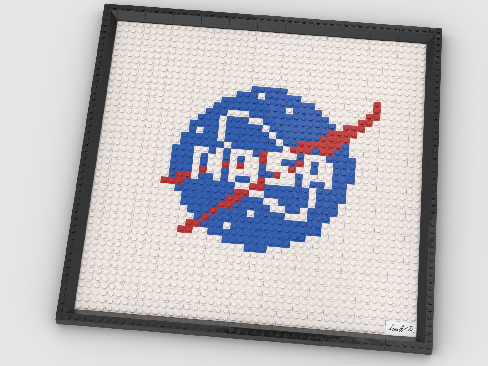
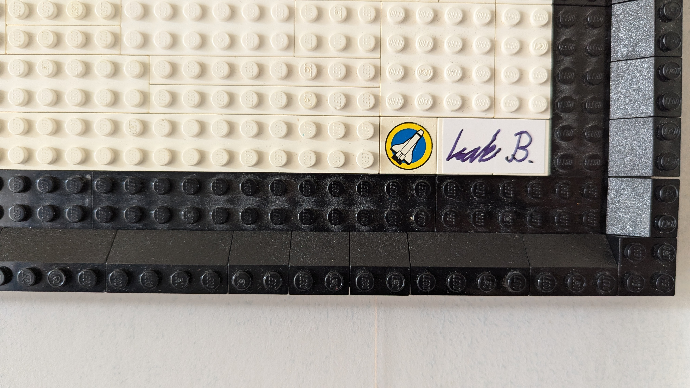

# LEGO NASA-logo painting

## Description
After my internship at NASA Ames Research Center in California, I got the idea of building the NASA meatball logo in LEGO. I designed the painting first in Bricklink Studio. The picture below displays a rendering from the software.

I then built it with real pieces (see result below).

I found a cool Space Shuttle piece which is a part of this awesome LEGO Space Simulation Station set from 1999 that I didn't remember that I had: https://www.bricklink.com/v2/catalog/catalogitem.page?S=6455-1#T=I. I might have to find the pieces and build it again:).

## Usage
To build the set you can just follow the instructions in the file instruction_manual.pdf. To open the CAD file, install Bricklink Studio and open the .io file.
